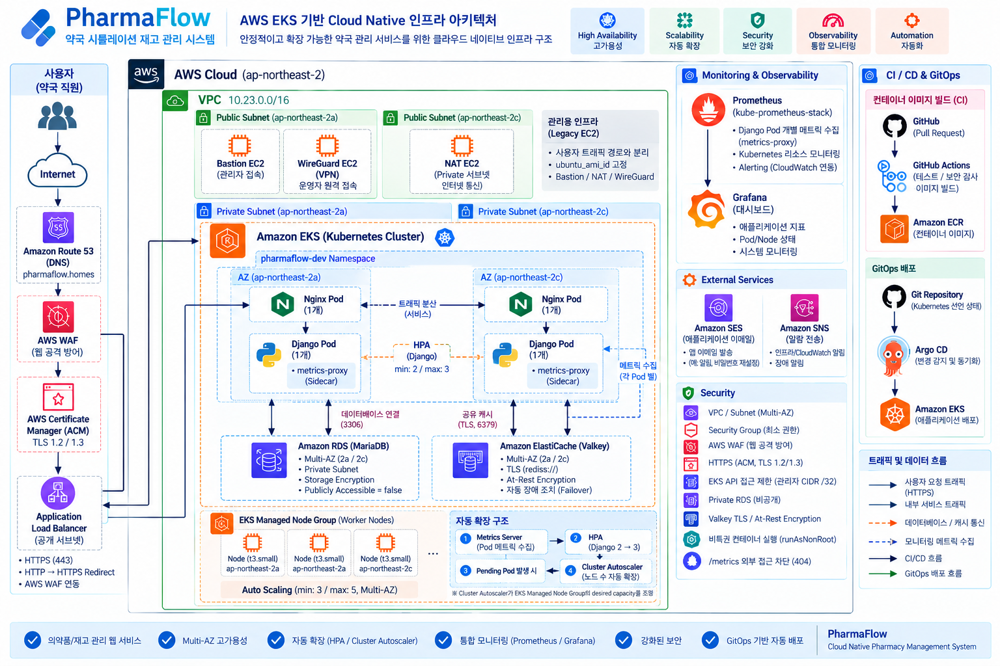

# PharmaFlow Infrastructure

PharmaFlow 약국 의약품 재고관리 시스템의 **AWS 인프라 및 Cloud Native
운영 환경**을 관리하는 저장소입니다.

기존 On-Premise 및 EC2/ASG 기반 구조에서 출발해 Terraform 기반 AWS
3-Tier 인프라를 거쳐, 최종적으로 **Amazon EKS · Kubernetes · Cluster
Autoscaler · Argo CD GitOps · Prometheus/Grafana · ElastiCache
Valkey**를 결합한 운영 환경으로 확장했습니다.

> 이 저장소의 핵심 역할은 **"PharmaFlow를 어디에서, 어떤 인프라 위에서
> 안정적으로 실행할 것인가"**를 코드로 관리하는 것입니다.

------------------------------------------------------------------------

## Project Evolution

### Project 1 --- On-Premise Application

-   Nginx · Django · DB 기반 약국 재고관리 서비스
-   사용자/약국 관리, 의약품 재고, 입출고, 발주, 상담/게시판 기능 구현
-   수동 배포 및 수동 복구 중심

### Project 2 --- AWS 3-Tier / Automation

-   AWS VPC · ALB · ASG · RDS · EFS 기반 3-Tier 구조
-   Multi-AZ 구성
-   Terraform IaC
-   Ansible 기반 Nginx/Django 서버 구성 자동화
-   Route 53 · ACM · WAF · CloudWatch · SNS · SES 연동
-   Health Check 분리 및 장애/복구 검증

### Project 3 --- Cloud Native

-   Docker Containerization
-   Amazon EKS / Kubernetes 전환
-   HPA · PDB · Cluster Autoscaler
-   GitHub Actions · ECR · Argo CD GitOps
-   Prometheus / Grafana Observability
-   ElastiCache Valkey 공유 캐시
-   Cloud Security 강화
-   Self-Healing · Auto Scaling · E2E 검증

------------------------------------------------------------------------

## Final Architecture





### Service Path

``` text
Client
  ↓
Route 53
  ↓
AWS WAF
  ↓
Public ALB + ACM / HTTPS
  ↓
Ingress
  ↓
Nginx Service
  ↓
Nginx Pods
  ↓
Django Service
  ↓
Django Pods
  ├─→ Amazon RDS MariaDB
  ├─→ ElastiCache Valkey
  └─→ Amazon EFS
```

서비스 트래픽은 EKS Control Plane을 통과하지 않습니다.\
EKS Control Plane은 Kubernetes 리소스와 Desired State를 관리하고, 실제
애플리케이션 Pod는 Managed Node Group의 Worker Node에서 실행됩니다.

### Observability Path

``` text
Django Pod
  ↓
metrics-proxy Sidecar
  ↓
Prometheus Pod Discovery / Scrape
  ↓
Prometheus
  ↓
Grafana
```

Django Replica별 메트릭이 하나의 시계열에 섞이지 않도록 **Pod 단위
Scrape 구조**를 적용했습니다.

### CI / GitOps Path

``` text
Developer
  ↓
GitHub
  ↓
GitHub Actions
  ↓
Amazon ECR
  ↓
Kustomize Image Tag Update
  ↓
Bot Commit
  ↓
Argo CD
  ↓
PreSync
  ├─ migrate
  └─ collectstatic
  ↓
Amazon EKS Rollout
  ↓
Synced / Healthy
```

------------------------------------------------------------------------

## Infrastructure Components

  -----------------------------------------------------------------------
  영역                                구성
  ----------------------------------- -----------------------------------
  Network                             VPC, Public/Private Subnet,
                                      Multi-AZ, Route Table, NAT,
                                      Security Group

  Edge                                Route 53, AWS WAF, ACM/HTTPS,
                                      Application Load Balancer

  Compute                             Amazon EKS, Managed Node Group,
                                      EC2/Bastion/WireGuard

  Data                                Amazon RDS MariaDB, Amazon EFS,
                                      ElastiCache Valkey

  Registry                            Amazon ECR

  Kubernetes                          Deployment, Service, Ingress, HPA,
                                      PDB, ConfigMap

  Auto Scaling                        HPA + Cluster Autoscaler

  Observability                       Metrics Server, Prometheus, Grafana

  Automation                          Terraform, Ansible, GitHub Actions,
                                      Argo CD

  Notification / Mail                 Amazon SNS, Amazon SES
  -----------------------------------------------------------------------

------------------------------------------------------------------------

## Repository Responsibility

PharmaFlow 프로젝트는 Application과 Infrastructure의 책임을
분리했습니다.

### PharmaFlow Application Repository

**무엇을 실행할 것인가**

-   Django Application Source
-   Django/Gunicorn Container
-   Nginx Container
-   Kubernetes Application Manifest
-   Application CI
-   GitOps Image Tag

Application Repository:\
https://github.com/Highbuilder08/PharmaFlow

### PharmaFlow Infrastructure Repository

**어디에서 실행할 것인가**

-   AWS Infrastructure
-   Terraform IaC
-   기존 EC2 환경용 Ansible
-   EKS / Managed Node Group
-   IAM / Pod Identity
-   Cluster Autoscaler
-   EKS Add-on
-   운영 및 검증 Script
-   Infrastructure 관련 문서

------------------------------------------------------------------------

## Terraform vs Argo CD

두 도구의 관리 범위를 분리했습니다.

### Terraform

AWS Infrastructure의 선언 상태를 관리합니다.

``` text
VPC / Subnet / Route
Security Group
ALB
RDS / EFS / ECR
EKS / Managed Node Group
IAM / Pod Identity
Route 53 / ACM / WAF
SES / SNS
```

### Argo CD

EKS 내부 Kubernetes Application의 Desired State를 관리합니다.

``` text
Django Deployment / Service
Nginx Deployment / Service
HPA / PDB
ConfigMap
Kustomize Image Tag
PreSync Hook
```

Cluster Autoscaler가 Runtime에서 Node Group의 `desiredSize`를 관리하므로
Terraform은 `minSize` / `maxSize` 경계를 관리하고, `desiredSize`는
`ignore_changes` 대상으로 분리했습니다.

------------------------------------------------------------------------

## High Availability & Auto Scaling

### Multi-AZ

Django와 Nginx Replica를 서로 다른 Availability Zone에 분산하도록
구성했습니다.

``` text
ap-northeast-2a
ap-northeast-2c
```

`topologySpreadConstraints`를 사용해 동일 종류의 Pod가 한 AZ에 과도하게
집중되는 것을 줄였습니다.

### Self-Healing

Pod를 실제로 삭제해 ReplicaSet이 자동으로 새 Pod를 생성하는지
검증했습니다.

-   Django Replica: 2
-   Nginx Replica: 2
-   Pod 강제 삭제 후 자동 복구
-   복구 중 HTTP 요청 정상 유지

### HPA + Cluster Autoscaler

``` text
HTTP Load
  ↓
CPU 증가
  ↓
Metrics Server
  ↓
HPA
  ↓
Django Pod 2 → 3
  ↓
Worker Capacity 부족 시 Pending
  ↓
Cluster Autoscaler
  ↓
Worker Node 증가
  ↓
Pending Pod Scheduling
```

최종 Terraform Node Group 경계:

``` text
minSize = 3
maxSize = 5
```

Django HPA:

``` text
minReplicas = 2
maxReplicas = 3
CPU Target  = 60%
```

------------------------------------------------------------------------

## Health Check

서비스 상태를 Liveness와 Readiness로 분리했습니다.

  Endpoint           목적
  ------------------ ---------------------------------
  `/health/live/`    애플리케이션 프로세스 생존 확인
  `/health/ready/`   현재 요청 처리 준비 상태 확인
  `/`                실제 서비스 루트 응답 확인

Liveness와 Readiness를 분리해 **재시작 판단**과 **트래픽 수신 가능
여부**를 구분했습니다.

------------------------------------------------------------------------

## Shared Storage & Cache

### Amazon EFS

Pod는 재생성될 수 있으므로 Static/Media 파일을 Pod 로컬 스토리지에
의존하지 않습니다.

``` text
Amazon EFS
  ↓
EFS CSI Driver
  ↓
RWX PVC
  ├─ Django Pods
  └─ Nginx Pods
```

### ElastiCache Valkey

Django Replica가 동일한 캐시 상태를 공유하도록 중앙 캐시를 구성했습니다.

-   `django_redis.cache.RedisCache`
-   `rediss://` TLS
-   Transit Encryption
-   At-Rest Encryption
-   Multi-AZ
-   Cache 장애 시 RDS 조회 Fallback

Cross-Pod 검증에서는 Pod A의 SET 값을 Pod B에서 GET하고, 반대 Pod에서
DELETE한 뒤 공유 상태가 제거되는 것을 확인했습니다.

------------------------------------------------------------------------

## Observability

`kube-prometheus-stack` 기반으로 Prometheus/Grafana 환경을 구성했습니다.

-   Django에 `django-prometheus` 적용
-   Django Pod마다 `metrics-proxy` Sidecar
-   Kubernetes Pod Discovery
-   Replica별 독립 Target
-   Prometheus Django Target `2/2 UP`
-   Grafana Dashboard
-   외부 `/metrics` 접근 `HTTP 404` 차단

Prometheus는 메트릭을 수집·저장하고, Grafana는 Prometheus의 데이터를
Dashboard로 시각화합니다.

------------------------------------------------------------------------

## Cloud Security

### Network

-   EKS Worker Public IP 없음
-   RDS `PubliclyAccessible = false`
-   Valkey 접근 범위를 EKS Security Group으로 제한
-   EKS API Public Access CIDR을 관리자 CIDR `/32`로 제한

### Data

-   RDS Storage Encryption
-   Valkey Transit Encryption
-   Valkey At-Rest Encryption

### Edge

-   AWS WAF
-   HTTP → HTTPS Redirect
-   ACM Certificate
-   TLS 1.2 / 1.3

### Workload

-   Django / metrics-proxy non-root
-   `allowPrivilegeEscalation = false`
-   Public `/metrics` 차단

------------------------------------------------------------------------

## GitOps Deployment

Git을 Kubernetes Desired State의 Source of Truth로 사용합니다.

``` text
PR Merge
→ GitHub Actions
→ Container Build / Test
→ Amazon ECR Push
→ Kustomize newTag Update
→ Bot Commit
→ Argo CD Auto Sync
→ PreSync migrate
→ PreSync collectstatic
→ EKS Rolling Update
→ Synced / Healthy
```

Rollback 역시 Cluster 상태만 직접 되돌리는 `kubectl rollout undo`보다
**Git 상태 자체를 `git revert`하여 Argo CD가 동기화하도록 하는 방식**을
사용했습니다.

------------------------------------------------------------------------

## Troubleshooting Highlights

### GitOps Rollback HTTP 502

Rollback 중 연속 300회 요청에서 일시적으로 2건의 502가 발생했습니다.

HTTP 실패 시각과 Kubernetes Event, Nginx upstream log를 대조해 Rollout
중 Worker Pod Capacity 부족과 신규 Pod 준비 지연 구간을 확인했습니다.

개선: - Node Group `minSize` 상향 - `maxUnavailable = 0` -
`maxSurge = 1` - `minReadySeconds = 10` -
`terminationGracePeriodSeconds = 45` - Nginx `preStop` 적용

재검증:

``` text
HTTP 200 = 300 / 300
5xx      = 0
```

### Cluster Autoscaler RBAC

Cluster Autoscaler 최초 기동 시 `resource.k8s.io` 계열 권한 누락으로
Controller가 Cluster Node를 정상 인식하지 못했습니다.

실제 사용 버전의 upstream RBAC Manifest와 비교해 필요한 권한을 추가했고,
이후 Scale-Out / Scale-Down을 정상 검증했습니다.

### Terraform AMI Pinning

`most_recent = true` 기반 Ubuntu AMI 탐색으로 새 AMI 공개 시 기존 EC2와
연관 자원이 대규모 교체 대상으로 잡히는 문제를 Terraform Plan 단계에서
발견했습니다.

검증된 Ubuntu AMI를 명시적으로 Pinning하도록 변경한 뒤:

``` text
Terraform Plan = No changes
REPLACEMENTS   = NONE
```

상태로 수렴시켰습니다.

------------------------------------------------------------------------

## Verification Results

  검증 항목                                     결과
  -------------------------- -----------------------
  Pod Self-Healing                      HTTP 60 / 60
  GitOps Self-Heal                    HTTP 274 / 274
  Rollback 개선 후             HTTP 300 / 300, 5xx 0
  PreSync 검증                        HTTP 180 / 180
  최종 E2E                            HTTP 300 / 300
  Django                                       2 / 2
  Nginx                                        2 / 2
  Pending Pod                                      0
  Prometheus Django Target                  2 / 2 UP
  Argo CD                           Synced / Healthy
  Terraform                               No changes
  Valkey Cross-Pod Cache                        PASS
  Public `/metrics`                         HTTP 404

------------------------------------------------------------------------

## Repository Structure

대표적인 구성은 다음과 같습니다.

``` text
PharmaFlow-Infrastructure/
├── environments/
│   └── prod/                  # AWS Production Terraform
├── ansible/                   # 기존 EC2 환경 구성 자동화
├── k8s/
│   └── cluster-autoscaler/    # Cluster Autoscaler Manifest
├── scripts/                   # 운영 Start/Stop 등 자동화 Script
└── docs/                      # 운영/검증 관련 문서
```

> 실제 디렉터리 구성은 프로젝트 진행에 따라 변경될 수 있습니다.

------------------------------------------------------------------------

## Terraform Workflow

Terraform 변경은 바로 Apply하지 않고 Plan을 먼저 검토하는 것을 원칙으로
합니다.

``` bash
cd environments/prod

terraform fmt -check
terraform validate
terraform plan
```

Plan에서 다음을 우선 확인합니다.

-   의도하지 않은 `replace`
-   `destroy`
-   Dynamic AMI 변경
-   Node Group Scaling 변경
-   Security / Network 변경

최종 검증에서는 Terraform 관리 범위가 다음 상태로 수렴하는 것을
확인했습니다.

``` text
No changes. Your infrastructure matches the configuration.
```

------------------------------------------------------------------------

## Security Notice

실제 운영 환경의 다음 값은 저장소에 직접 커밋하지 않는 것을 원칙으로
합니다.

-   AWS Access Key / Secret Key
-   DB Password
-   Django Secret Key
-   실제 Secret 값
-   민감한 환경 변수
-   개인 관리자 접근 정보

`terraform.tfvars`, Kubernetes Secret 등 실제 환경값은 Git 추적 대상에서
제외하고, 저장소에는 Example/Placeholder 형태만 제공합니다.

------------------------------------------------------------------------

## Related Repository

-   Application: https://github.com/Highbuilder08/PharmaFlow
-   Infrastructure:
    https://github.com/Highbuilder08/PharmaFlow-Infrastructure

------------------------------------------------------------------------

## Project Summary

PharmaFlow Infrastructure는 단순히 AWS 리소스를 생성하는 Terraform
저장소에서 끝나지 않고,

**AWS Infrastructure → EKS → Auto Scaling → Observability → Cache →
Security → CI/CD → GitOps → 장애 복구 검증**

까지 연결한 Cloud Native 운영 환경을 코드와 검증 결과로 관리하는 것을
목표로 합니다.

최종적으로 **Git의 선언 상태와 실제 운영 상태가 일치하고, 장애·부하·배포
상황에서도 자동 복구와 확장이 가능한 구조**를 구현하고 검증했습니다.
